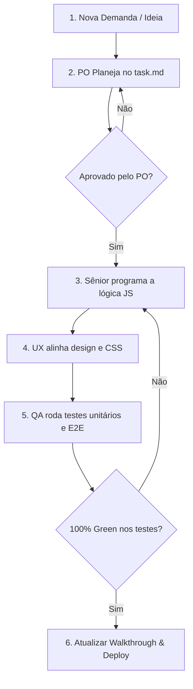

# Manual de Desenvolvimento e Fluxo de Qualidade: Amazing Franklin SaaS

Este documento estabelece as diretrizes de engenharia, qualidade e fluxo de aprovação obrigatórios para qualquer alteração no código do portal multi-tenant **Amazing Franklin**. Todas as contribuições (sejam de desenvolvedores humanos ou agentes de IA) devem seguir estritamente as regras e o pipeline abaixo.

---

## 👥 1. Papéis e Responsabilidades (Equipe de Agentes)

O desenvolvimento é estruturado em papéis especializados com foco em qualidade de ponta a ponta:

1.  **Product Owner (PO)**:
    *   **Responsabilidade**: Define os requisitos de negócio, detalha histórias de usuário e mantém o backlog ativo no arquivo `task.md`.
    *   **Aprovação**: Nenhuma funcionalidade ou alteração de código pode ser iniciada sem que os critérios de aceitação e tarefas estejam descritos e aprovados pelo PO no backlog.
2.  **Senior Developer (Programador Sênior)**:
    *   **Responsabilidade**: Escreve o código lógico em JavaScript, cuida de integrações, segurança e persistência de dados.
    *   **Padrão de Código**: Segue regras de Clean Code e padrões semânticos (ex: Airbnb Style Guide). Mantém a lógica separada do design.
3.  **UX/UI Specialist (Especialista em Interface)**:
    *   **Responsabilidade**: Garante a excelência estética, alinhamentos, responsividade de telas e uso estrito das variáveis de cor institucionais no `style.css`.
    *   **Aprovação**: Valida se elementos novos não causam quebras de texto, desalinhamentos ou problemas em dispositivos móveis.
4.  **QA Tester (Garantia de Qualidade)**:
    *   **Responsabilidade**: Escreve e executa testes unitários/API (Jest) e testes de aceitação no navegador (Playwright E2E).
    *   **Aprovação**: O código só é considerado pronto e elegível para fusão (merge/deploy) se **100% da suíte de testes passar (zero falhas)**.

---

## 🔄 2. Pipeline de Entrega de Funcionalidades (Workflow)

### Passo a Passo de Execução:
1.  **Planejamento**: O PO abre uma checklist de tarefas no arquivo `task.md` detalhando os objetivos da demanda.
2.  **Desenvolvimento**: O programador cria os elementos HTML e desenvolve a lógica.
3.  **Estilização**: O UX Designer insere as regras de posicionamento (flex, grid), margens e cores.
4.  **Validação**: O QA roda `npm test` e `npx playwright test`. Qualquer erro de console ou seletor instável aciona o retorno ao passo de desenvolvimento.
5.  **Documentação**: Ao finalizar com testes verdes, o Walkthrough do projeto (`walkthrough.md`) deve ser atualizado descrevendo o que foi modificado e como testar.

---

## 🎨 3. Padrões de Código e UX/UI

### Lógica (JavaScript):
*   Sempre utilize nomes de variáveis e funções em inglês semântico, CamelCase (ex: `startTelemedCall`).
*   Todos os dados de persistência local devem seguir a nomenclatura de chaves no `localStorage` sob o prefixo `amazing_franklin_`.
*   Sempre descarte de forma limpa instâncias e streams externos (ex: `api.dispose()`) para evitar vazamentos de memória.

### Estilização (CSS):
*   Nunca utilize estilos inline improvisados se puder reaproveitar classes utilitárias ou variáveis.
*   Utilize o sistema de cores institucionais oficiais definidas no `style.css`:
    *   `--primary-olive`: Verde Oliva (`#607361`) - Principal/Sucesso
    *   `--bronze-gold`: Dourado Bronze (`#a3835b`) - Destaques/Secundário
    *   `--terracotta`: Terracota (`#c95d4a`) - Avisos/Ações Secundárias
    *   `--lavender`: Lavanda/Roxo (`#8b7eb3`) - Clínico Alternativo
*   Todos os elementos de interface interativos (cards, botões, modais) devem ter bordas arredondadas e suavizadas (`var(--radius-lg)` ou `var(--radius-md)`).

---

## 🧪 4. Critérios de Teste e Qualidade

*   **Testes de Interface (E2E)**: Qualquer novo botão ou formulário crítico deve possuir seletores estáveis (ex: IDs exclusivos ou atributos descritivos).
*   **Isolamento Multi-Tenant**: Testes devem verificar explicitamente que dados de um clínica (inquilino/tenant) não são visíveis para pacientes ou profissionais de outro consultório.
*   **Controle de Licenciamento**: Se o status de pagamento do inquilino for alterado para `suspended`, a tela de bloqueio deve impedir qualquer navegação imediata.
